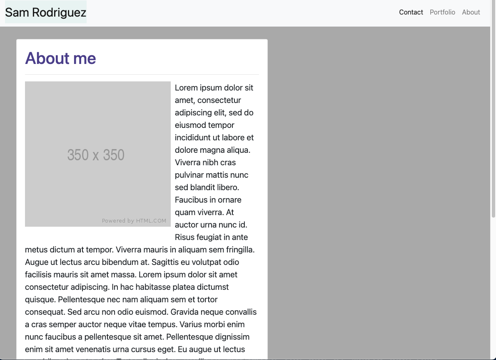

# Responsive Portfolio

  
  

---

## Table of Contents
- [About the Project](#About-the-Project)
- [Getting Started](#Getting-Started)
- [Installation](#Installation)
- [Contributing](#Contributing)
- [Testing](#Testing)
- [License](#License) 

## About the Project
This is a sample responsive portfolio template.  The user is presented with three web pages:  About Me, Portfolio, and Contact Me.  The pages are responsive and therefore will work on most screens.

## Getting Started  
To get started, follow the Installation instructions below.    
    

### Installation  
Installation is not required.

## Testing
No testing required.
  

## Contributing
No contribution is required at this time 

## License
This application is covered under the MIT license.  

